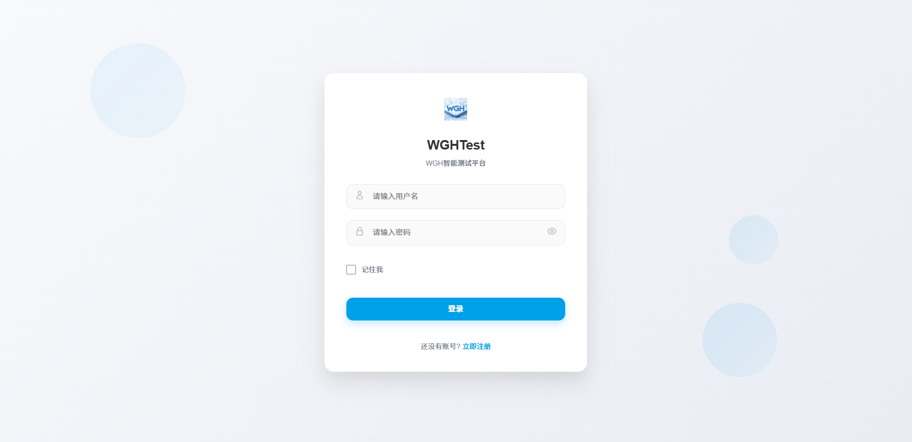
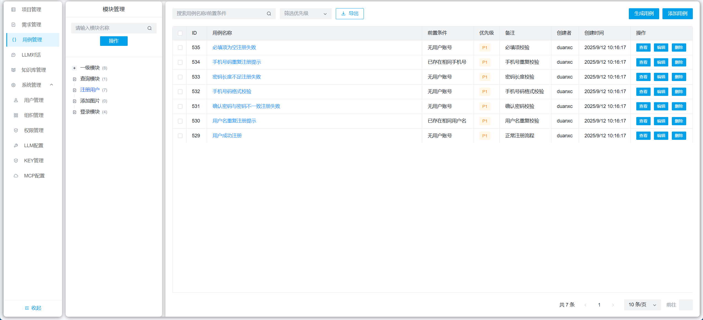
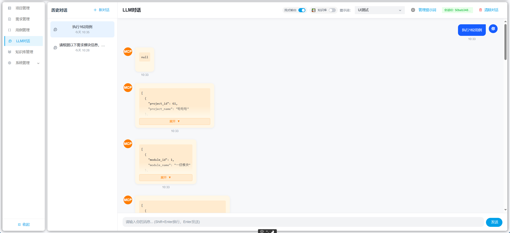
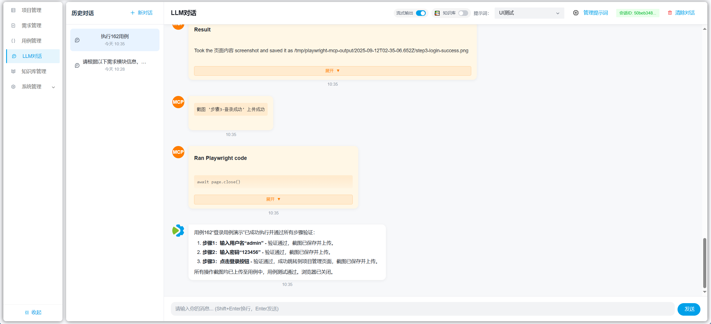
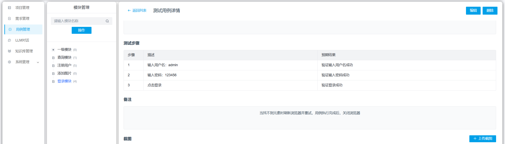
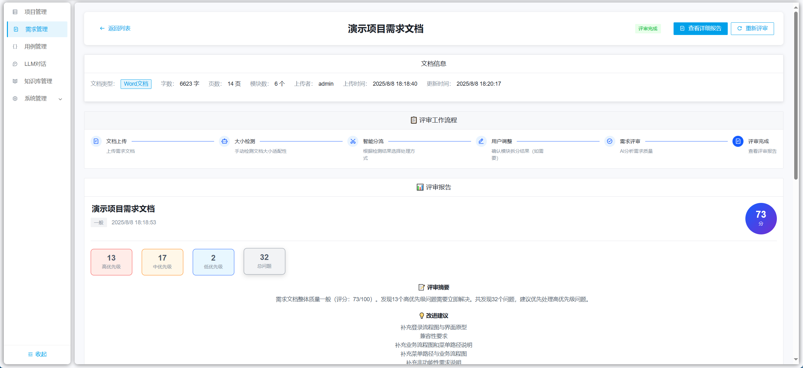
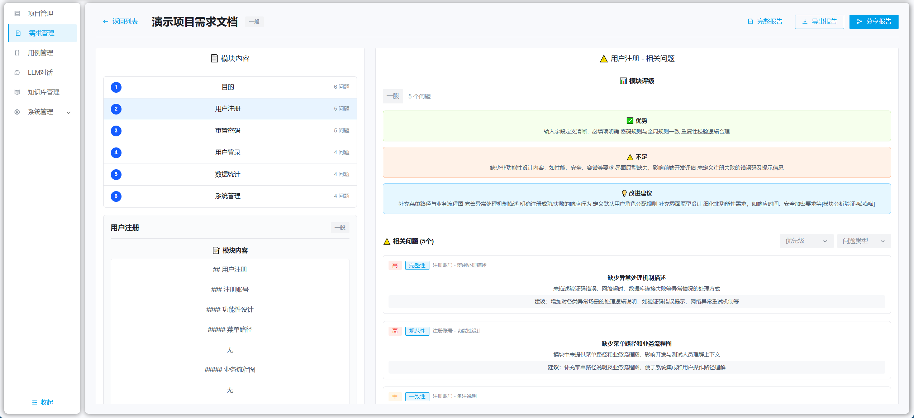

# WHartTest - AI驱动的智能测试用例生成平台

## 项目简介

WHartTest 是一个基于 Django REST Framework 构建的AI驱动测试自动化平台，核心功能是通过AI智能生成测试用例。平台集成了 LangChain、MCP（Model Context Protocol）工具调用、项目管理、需求评审、测试用例管理以及先进的知识库管理和文档理解功能。利用大语言模型和HuggingFace嵌入模型的能力，自动化生成高质量的测试用例，并结合知识库提供更精准的测试辅助，为测试团队提供一个完整的智能测试管理解决方案。


## 文档
详细文档请访问：https://mgdaaslab.github.io/WHartTest/

## 快速开始

### Docker 部署（推荐）

#### 使用预构建镜像（无需本地构建）
```bash
# 1. 克隆仓库
git clone https://github.com/MGdaasLab/WHartTest.git
cd WHartTest

# 2. 配置环境变量
cp .env.example .env
# 编辑 .env 文件，设置必要的环境变量

# 3. 启动服务（自动拉取预构建镜像）
docker-compose up -d
```

详细的部署说明请参考：
- [GitHub 自动构建部署指南](./docs/github-docker-deployment.md)
- [完整部署文档](https://mgdaaslab.github.io/WHartTest/)

## 页面展示

| | |
  |---|---|
  |  |  |
  | |  |
  |  |  |
  |  |  |
  |  |  |
  |  |  |
## 贡献指南

1. Fork 项目
2. 创建功能分支
3. 提交更改
4. 创建 Pull Request


## 联系方式

如有问题或建议，请通过以下方式联系：
- 提交 Issue
- 项目讨论区


---

**WHartTest** - AI驱动测试用例生成，让测试更智能，让开发更高效！
