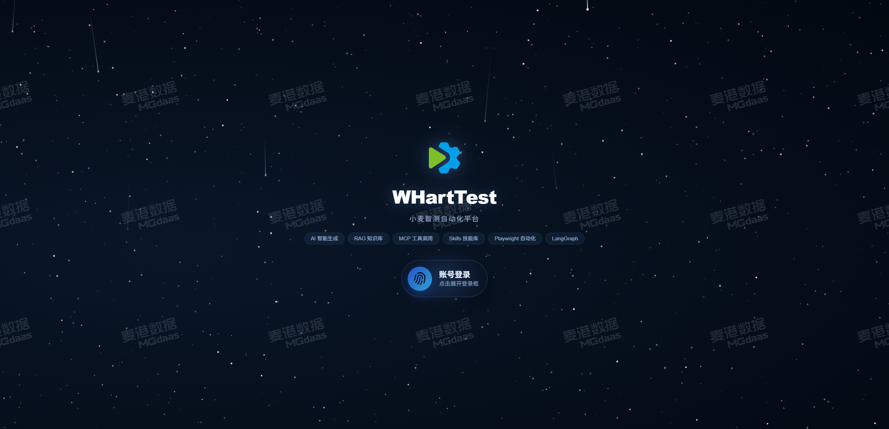
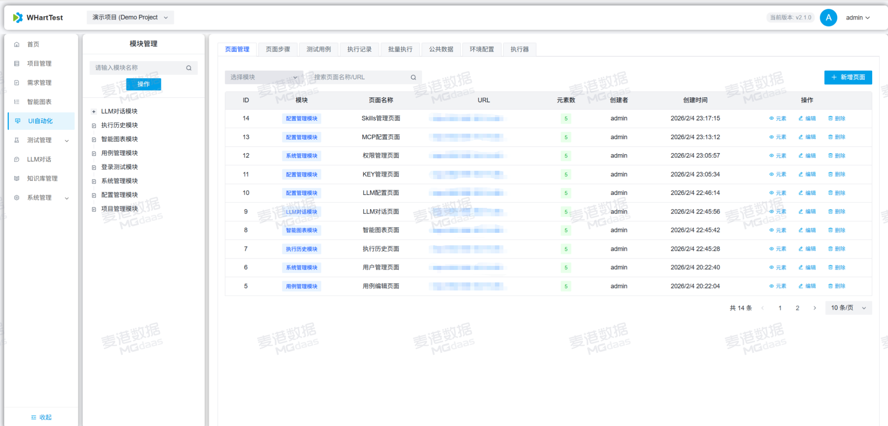
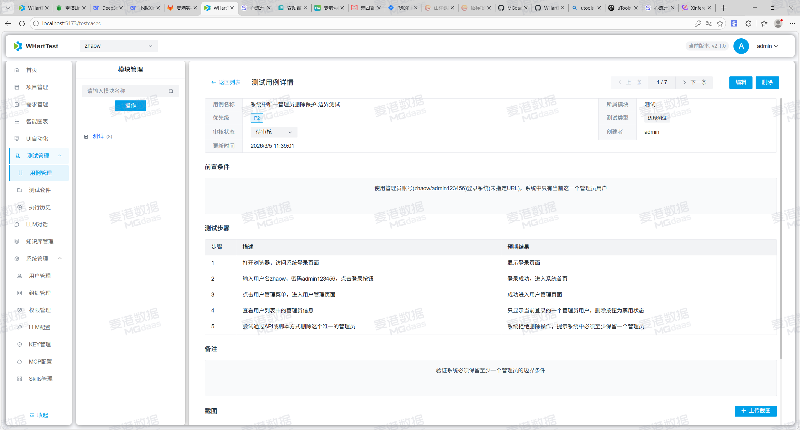
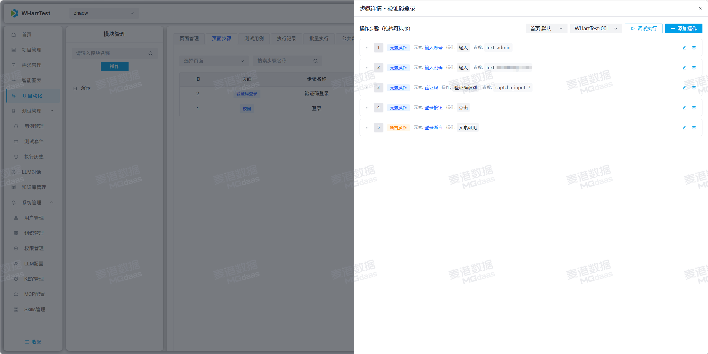

# WHartTest - AI驱动的智能测试用例生成平台

[](https://nerq.ai/safe/MGdaasLab/WHartTest)

中文 | [English](README_EN.md)

## 项目简介

WHartTest 是基于 **Django 5.2 + DRF** 与现代大模型技术打造的 **AI 驱动智能测试平台**。平台采用前后端分离的 Monorepo 架构，由 6 个子项目组成（Django 后端、Vue 前端、UI 自动化执行器、MCP 工具服务、Agent 技能库、在线文档编辑器），聚合自然语言理解、知识库检索与嵌入搜索能力，结合 **LangChain/LangGraph** 与 **MCP（Model Context Protocol）** 工具调用，实现从需求到可执行测试用例的自动化生成、管理与执行，为测试团队提供完整的智能测试管理解决方案。

## 平台功能

### AI 智能测试用例生成
基于大语言模型（LLM）技术，实现从需求到测试用例的智能转化：
- **多源输入**：支持需求文档、AI 对话、知识库检索等多种输入方式
- **结构化输出**：自动生成包含测试步骤、前置条件、输入数据、期望结果、优先级（P0-P3）的完整用例
- **流式对话**：LangGraph 驱动的流式 AI 对话，支持上下文摘要压缩与 Token 用量统计
- **多模型支持**：OpenAI、Azure OpenAI、Ollama、Xinference 等 OpenAI 兼容格式 LLM

### 智能编排（Orchestrator）
AI 驱动的端到端测试生成流水线：
- **自动化编排**：需求→知识库检索→AI 分析→测试用例生成
- **交互式执行**：执行计划确认，支持 Agent Loop 分步执行
- **HITL 审批**：人工审批中间件，关键节点可人工介入

### 知识库管理与文档理解
构建项目级知识库，为 AI 生成提供精准上下文：
- **多格式支持**：PDF、Word、Excel、PPT、Markdown、网页链接
- **智能分块**：自动文档解析、分块与向量化存储，支持图片提取与多模态嵌入
- **混合检索**：Dense + BM25 Sparse 稀疏-稠密混合检索 + RRF 融合排序
- **Reranker 精排**：可配置重排序模型提升检索精度

### MCP 工具集成
通过 Model Context Protocol 实现 AI 与测试工具的无缝对接：
- **远程服务管理**：streamable-http、SSE 等传输协议，支持多服务器配置
- **工具发现与同步**：自动从 MCP 服务器发现并同步可用工具
- **HITL 人工审批**：工具级别的敏感操作人工确认机制
- **内置工具集**：WHartTest 自身 MCP 工具（项目/模块/用例 CRUD）及第三方平台集成

### 需求评审与风险分析
AI 驱动的需求质量评估，提前识别潜在风险：
- **六维评分体系**：完整度、清晰度、一致性、可测性、可行性、逻辑性
- **状态流转**：上传→处理→模块拆分→用户调整→待评审→评审中→完成
- **专项分析报告**：8 种分析维度的独立报告
- **在线文档编辑**：集成 ONLYOFFICE 文档编辑器，支持 AI 补全与 AI 分析插件

### 测试用例管理
全生命周期的测试用例管理能力：
- **5 级模块树**：灵活的用例组织结构
- **7 种测试类型**：覆盖功能、接口、性能、安全等测试场景
- **用例审核**：待审核、通过、优化、不可用等状态流转
- **测试套件**：灵活组合用例，支持并发执行配置
- **Excel 导入/导出**：可配置字段映射的模板系统
- **批量操作**：用例的批量创建、编辑、移动、删除

### UI 自动化测试
低代码 UI 自动化，降低自动化测试门槛：
- **可视化编排**：5 级模块 → 页面管理 → 元素定位 → 步骤编排 → 用例组装
- **9 种定位策略**：CSS、XPath、Text、Role、Label、Placeholder、AltText、Title、TestId
- **6 种步骤类型**：元素操作、断言、SQL 查询、自定义变量、条件判断、Python 代码
- **多浏览器支持**：Chromium / Firefox / WebKit，支持持久化浏览器上下文
- **Trace 追踪**：完整的截图、Trace 录制与回放

### APP 自动化测试
集成 mobile-mcp，支持移动端应用自动化测试：
- **多平台支持**：Android、iOS 设备自动化
- **元素交互**：点击、滑动、输入、手势操作
- **屏幕操作**：截图、录屏、亮度/音量调节

### Skill 智能技能系统
可扩展的 Agent 技能管理框架：
- **多来源导入**：ZIP 文件上传、Git 仓库导入
- **SKILL.md 规范**：标准化的技能描述文件
- **内置技能**：浏览器自动化（Playwright/agent-browser）、图表生成（Draw.io）、知识库查询、平台 CLI 工具
- **安全隔离**：技能文件独立存储，防止路径穿越攻击
- **专属资源**：加入技术交流群获取经过微调优化的 Skills 和 MCP 工具包

### 任务中心
定时/周期任务调度：
- **4 种调度策略**：一次性 / 每小时 / 每天 / 每周
- 关联 UI 自动化或测试套件执行
- 失败重试策略，基于 Celery Beat 数据库调度器

### 执行报告与分析
全面的测试执行结果分析：
- **实时监控**：执行进度、状态实时更新
- **多维度统计**：通过率、执行时长、失败原因分析
- **历史对比**：支持执行结果的历史趋势分析

## 文档
详细文档请访问：https://mgdaaslab.github.io/WHartTest/

## 快速开始

### Docker 部署（推荐 - 开箱即用）

```bash
# 1. 克隆仓库
git clone https://github.com/MGdaasLab/WHartTest.git
cd WHartTest

# 2. 准备配置（使用默认配置，包含自动生成的API Key）
cp .env.example .env

# 3. 一键启动（以下两种方式二选一）
# 方式一：使用部署脚本（推荐，支持镜像源择优）
./run_compose.sh

# 方式二：直接使用 docker-compose
docker-compose up -d

# 4. 访问系统
# http://localhost:8913 (admin/admin123456)
```

**就这么简单！** 系统会自动创建默认API Key，MCP服务开箱即用。

### 统一部署脚本

如果你使用仓库自带脚本部署，现在启动后会先让你在“远程拉镜像”和“本地构建镜像”之间二选一：

```bash
./run_compose.sh
```

这个脚本现在会：

- 先选择部署方式：`remote` 远程镜像下载，或 `local` 本地构建镜像
- `remote` 模式会自动在内置远程镜像仓库候选里测速择优，用户只需选择 `1` 即可
- `remote` 会按仓库类型分别选择：Docker Hub 使用官方 / `docker.1panel.live` / `docker.1ms.run` / `docker.xuanyuan.me` / `docker.m.daocloud.io`，GHCR 使用官方 / `ghcr.1ms.run` / `ghcr.nju.edu.cn` / `ghcr.m.daocloud.io`，MCR 使用官方 / `mcr.azure.cn` / `mcr.m.daocloud.io`
- `local` 模式会自动探测当前网络下更快的 `APT / PyPI / npm / Hugging Face` 下载地址
- Python 依赖安装现在支持自动回退：首选测速最快的 PyPI 源，某个包下载超时会顺序切到其余候选继续安装
- `local` 内置候选包含官方源、清华、中科大、阿里云、腾讯云、华为云、北外、上海交大、`npmmirror`、`hf-mirror` 等
- 支持通过环境变量继续追加你自己的候选镜像源
- 本地构建默认使用 Docker 缓存，不再每次都 `--no-cache`

常用示例：

```bash
# 交互选择部署方式
./run_compose.sh

# 直接使用远程预构建镜像
./run_compose.sh remote

# 直接使用本地构建，并自动选择更快下载源
./run_compose.sh local

# 本地构建时强制使用原生官方源
DOCKER_SOURCE_PROFILE=native ./run_compose.sh local

# 本地构建时强制只在镜像源里择优
DOCKER_SOURCE_PROFILE=mirror ./run_compose.sh local

# 给 PyPI 追加自定义候选源（注意用引号包起来）
DOCKER_PIP_CANDIDATES_EXTRA="corp|https://pypi.example.com/simple|https://pypi.example.com/simple/pip/" ./run_compose.sh local

# 只有在本地全量重建时才禁用缓存
DOCKER_BUILD_NO_CACHE=1 ./run_compose.sh local
```

> ⚠️ **生产环境提示**：请登录后台删除默认API Key并创建新的安全密钥。详见 [快速启动指南](./docs/QUICK_START.md)

详细的部署说明请参考：
- [快速启动指南](./docs/QUICK_START.md) - **推荐新用户阅读**
- [GitHub 自动构建部署指南](./docs/github-docker-deployment.md)
- [完整部署文档](https://mgdaaslab.github.io/WHartTest/)

## 页面展示

| | |
  |---|---|
  |  |  |
  |  |  |
  |  |  |
  |  |  |
  |  |  |
  |  |  |
  |  |  |
  |  |  |
## 贡献指南

1. Fork 项目
2. 创建功能分支
3. 提交更改
4. 创建 Pull Request


## 联系方式

如有问题或建议，请通过以下方式联系：
- 提交 Issue
- 项目讨论区
- 添加微信时请备注   github   ，拉你进微信群聊。
- 加群获取最新更新信息及SKill。


qq群：
1. 8xxxxxxxx0（已满）
2. 1017708746
---
## 【重要安全警示】关于 v1.4.0 以及后续版本 Skills 权限及部署安全的声明
鉴于 Skills 模块具备较高的系统执行权限，为了保障您的数据与环境安全，我们做出以下严正提示：

部署建议：强烈建议仅在内网环境或受信任的私有网络中部署使用。 访问控制：切勿将服务直接暴露于公网（Public Internet），或授予任何未经身份验证及不可信人员访问权限。 免责声明：本项目（WHartTest）仅供学习与研究使用。用户需自行承担因违规部署（如开放公网、未做鉴权等）所导致的一切安全风险与后果。对于因不当配置引发的数据泄露、服务器被入侵等安全事故，WHartTest 团队不承担任何法律及连带责任。
**WHartTest** - AI驱动测试用例生成，让测试更智能，让开发更高效！
