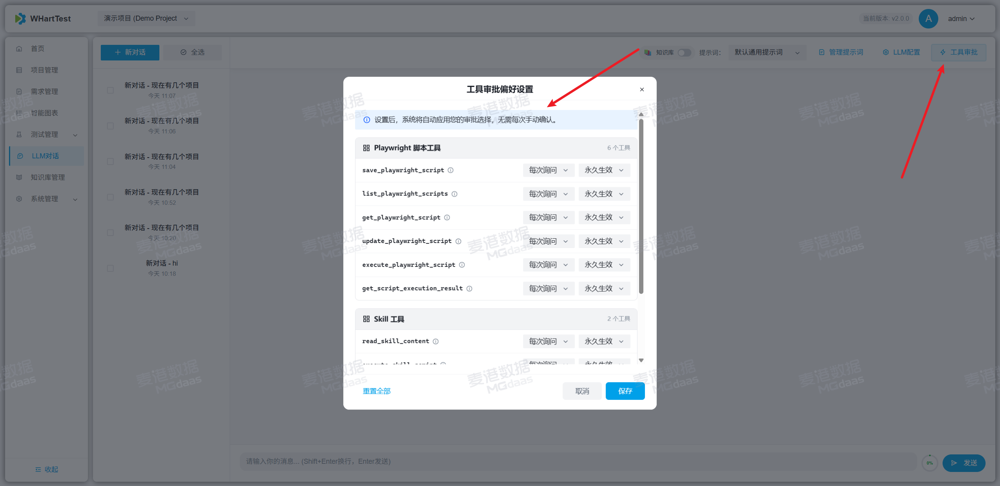
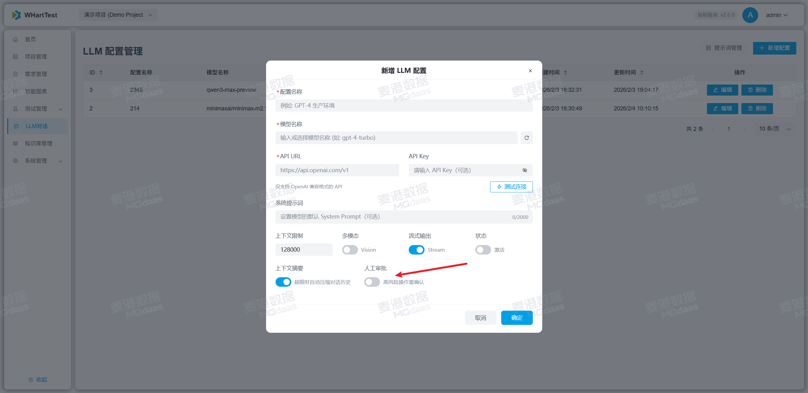
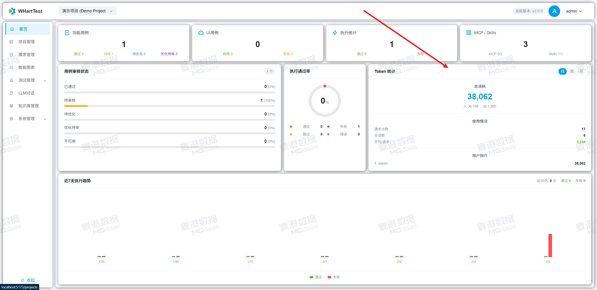
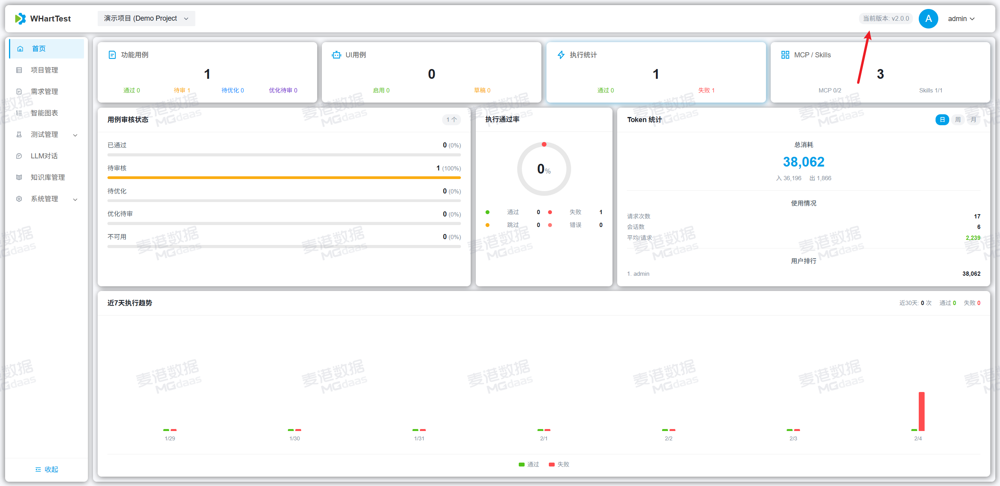

# 操作手册 (v2.0.0)

::: tip 版本说明
本操作手册基于 **v2.0.0** 版本编写。
:::

## 🚀 重大升级

### LangChain & LangGraph 架构升级
- 升级 LangChain 和 LangGraph 至最新版本
- 重构 Agent Loop 架构，采用 `create_agent()` 统一创建方式
- 引入 Middleware 模式：SummarizationMiddleware 自动上下文压缩、HumanInTheLoopMiddleware 处理 HITL 审批
- 统一使用 LangChain 标准库计算 Token 用量

## ✨ 新功能

### Agent 与 AI 能力增强
- **工具自动拒绝策略**：在工具偏好设置中可为指定工具配置"始终拒绝"策略，AI 调用该工具时将自动拒绝执行，无需人工确认弹窗
- **HITL 工具审批**：图表编辑器集成工具审批卡片，支持中断事件处理与执行恢复
- **agent-browser 集成**：集成 agent-browser 工具并优化执行稳定性

### Token 用量追踪
- 集成 Token 用量追踪与统计看板
- 优化 Token 统计日期逻辑与前端服务集成
- 新增 LLM 模型列表获取代理接口

### 项目与仪表盘
- **资源统计优化**：调整首页资源统计显示与页面布局
- **版本检查功能**：界面展示当前版本号并自动检测 GitHub 新版本更新

### 系统配置
- **LLM 配置优化**：测试连接后状态自动流转，防止重复创建
- **Draw.io 降级机制**：加载超时自动降级至公共服务

## 🐛 问题修复

### Token 计费统计
- 修正 Token 计算逻辑，避免 input_tokens 重复累加
- 优化计费精度，使用 LLM 返回的真实 usage_metadata
- 修复日期筛选的时区偏差问题

### 会话与消息处理
- 修复重试时消息截断导致前后端不同步问题
- 修复用户消息中 HTML 内容被解析及换行丢失问题
- 优化流式响应在等待审批时的状态判断

### 界面与交互
- 优化测试用例列表表格滚动与高度自适应
- 优化接口错误处理逻辑，优先展示详细错误信息

## 🔧 优化改进

- 简化 Token 指示器与工具审批卡片 UI 展示
- 增强系统诊断工具，新增 Qdrant 向量一致性校验
- 优化 MEDIA_ROOT 配置，支持环境变量灵活定义
- 执行统计汇总周期由 30 天调整为 7 天
- 增强安装脚本跨平台兼容性并重构 JSON 解析逻辑
- 新增系统操作手册并更新运行环境与 Skills 资源

---
