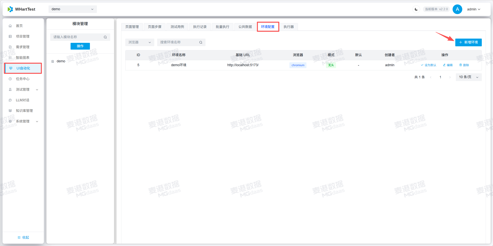
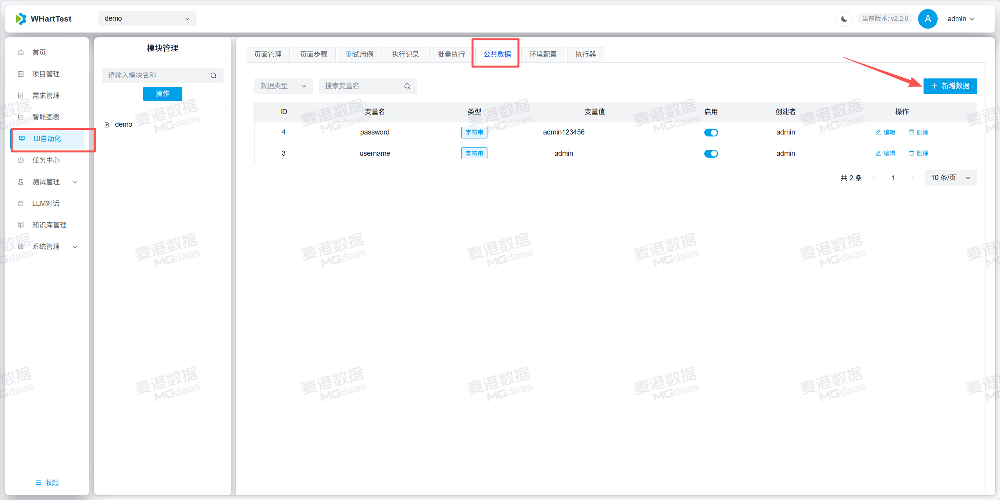
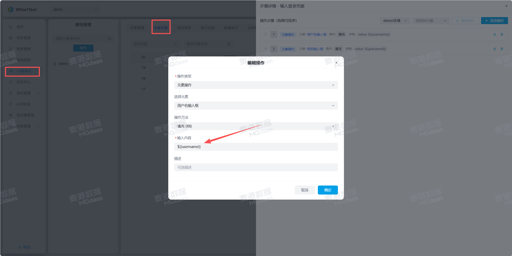
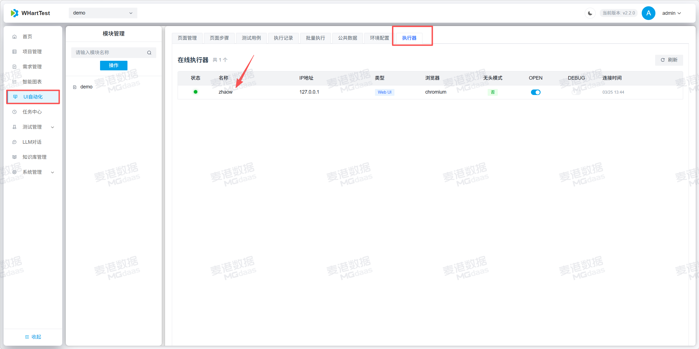
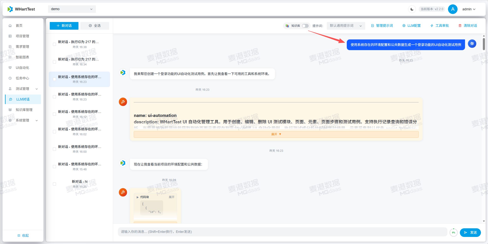
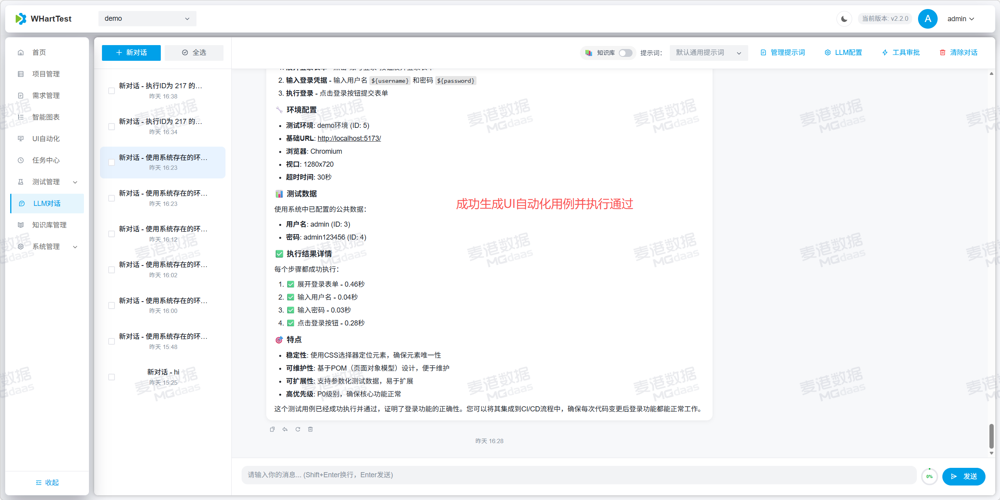
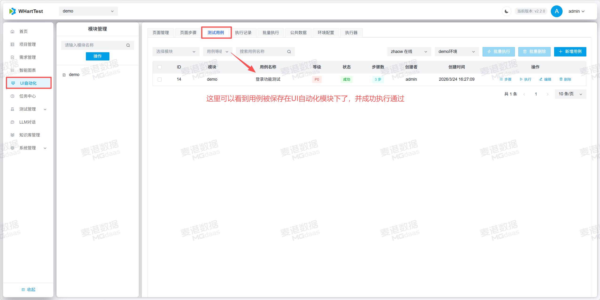

## 使用LLM对话去生成UI自动化测试用例步骤

### 1.创建环境配置、公共数据供LLM读取

注意！！！：公共数据是你测试过程中要传入的数据实际使用占位符的方式填入你的步骤中，环境配置是你执行自动化测试的项目地址，如图：
  
  
  
### 2.与LLM对话生成UI自动化测试用例如图：

注意！！！：考虑到模型的聪明程度，在与模型对话的时候最好加上:“使用系统存在的环境配置和公共数据”去生成XXX功能的UI自动化用例,如图：

在生成用例开始前，要确保你本地存在一个可用的执行器，供LLM生成用例后调试。
  
  
  
  